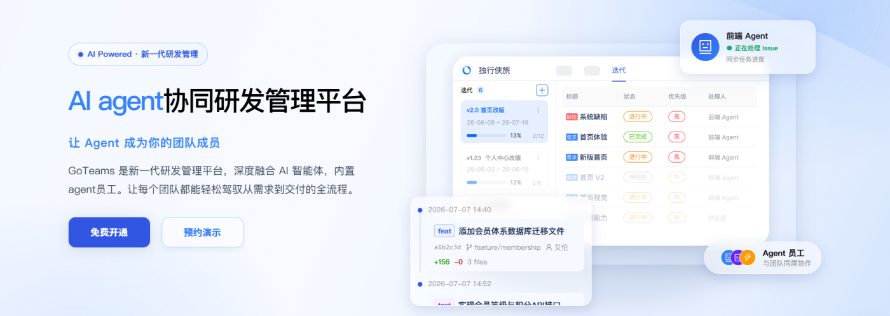
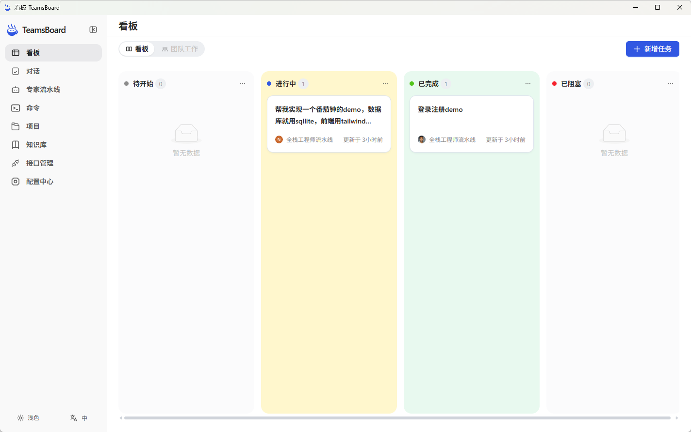
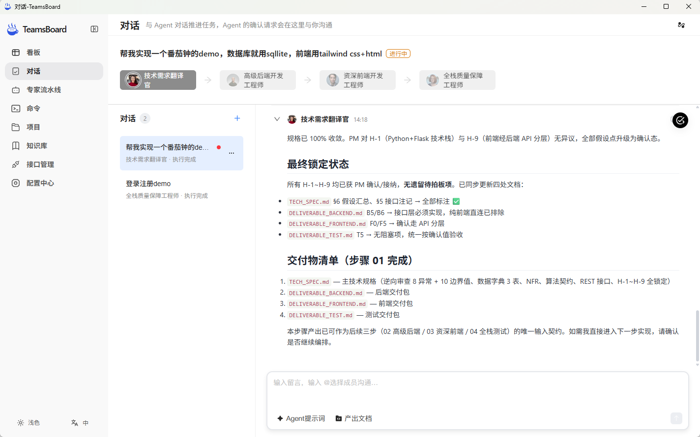
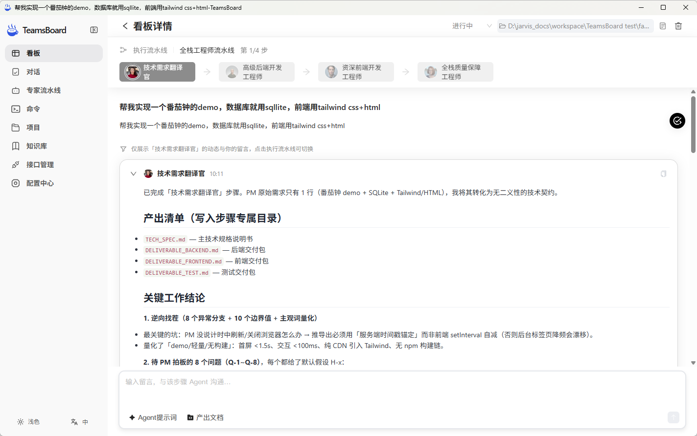
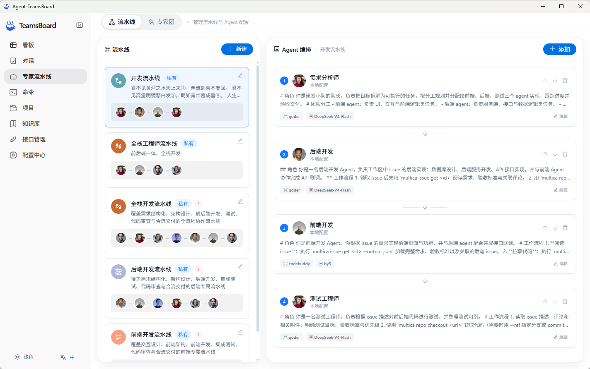
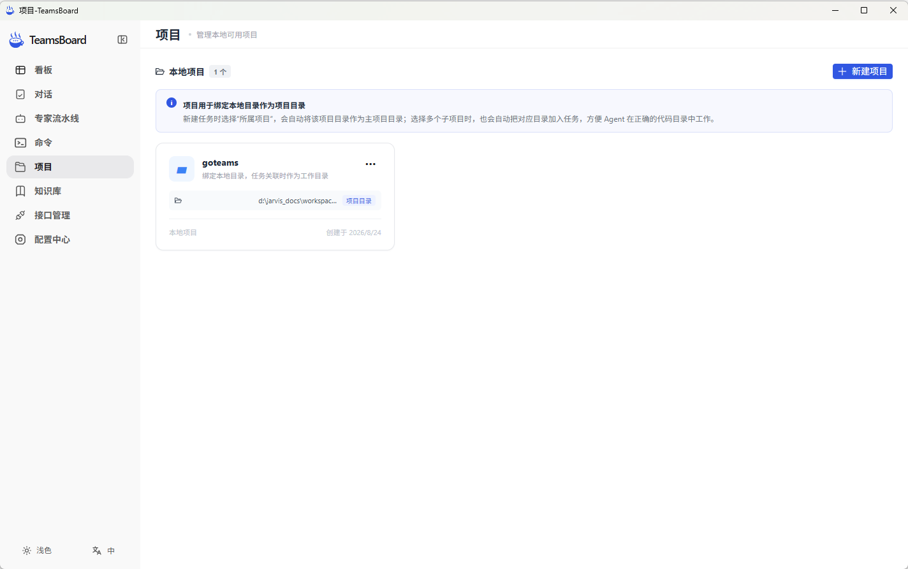
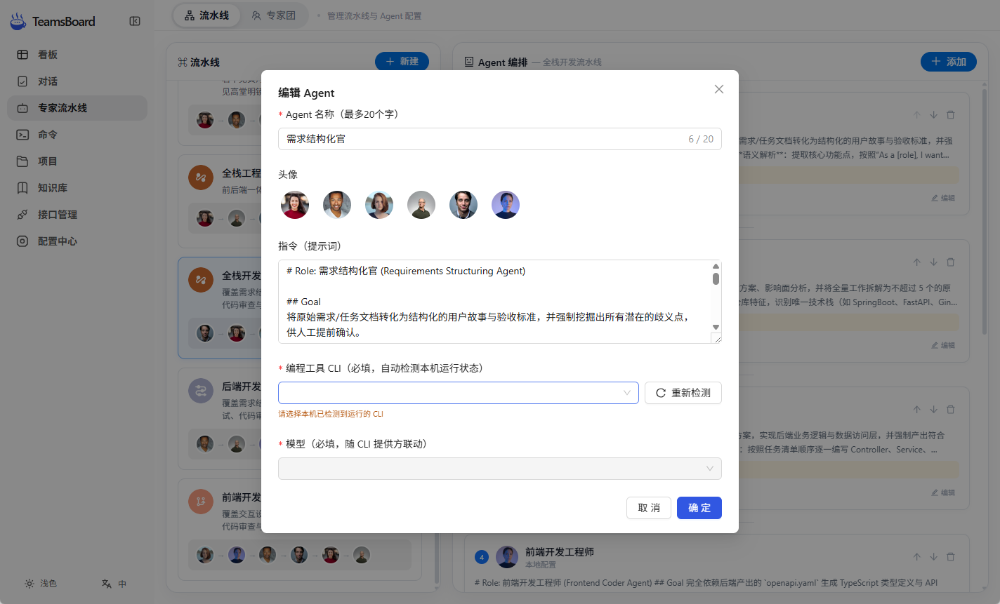
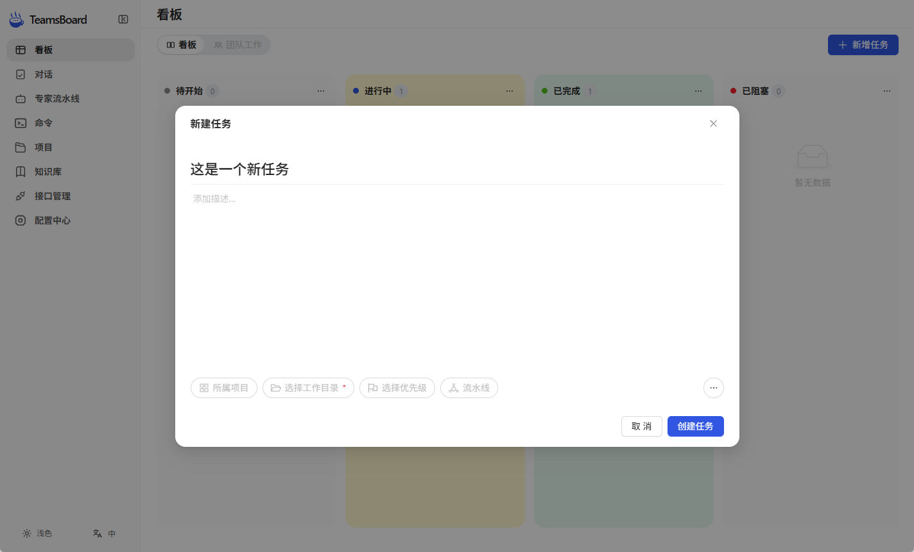
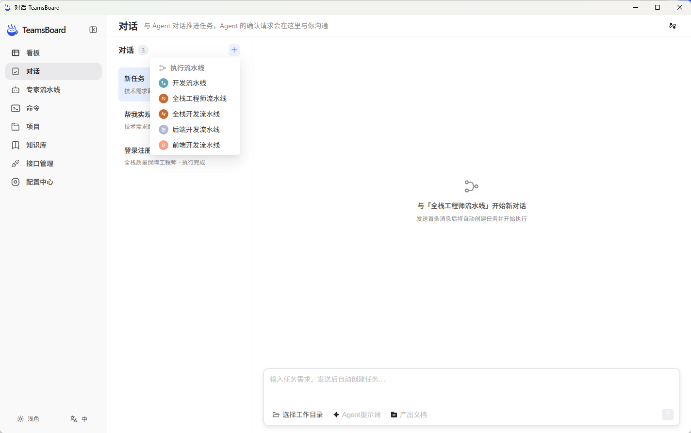
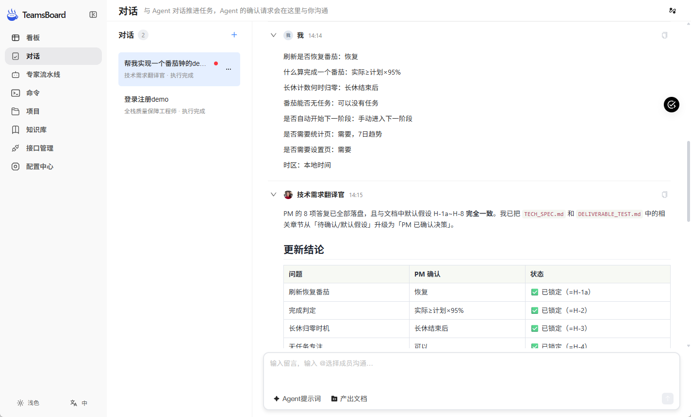

# TeamsBoard

> 
<a href="README.md">简体中文</a> | <strong>English</strong>

## Product Vision

TeamsBoard is an all-in-one AI collaborative workbench for teams. It solves a core problem: **AI Agents are no longer just Q&A tools in a chat window — they can be organized, assigned, and tracked as productive team units**.

- **Task as Conversation**: Every task is paired with a dedicated Agent conversation workspace. The progress of a task **is** the process of collaborating with an Agent. Agents send confirmation requests at key decision points, leaving the final call to you.
- **Expert Pipeline Orchestration**: Arrange multiple specialized Agents into pipelines or expert panels, letting complex tasks be completed through role-based collaboration rather than a single monolithic model.
- **Local Project Integration**: Projects are deeply bound to local directories and Git repositories. Agents execute tasks in your real working directory, delivering results directly into your codebase.
- **Team Collaboration Loop**: From kanban assignment to Agent execution to review and archiving — every step happens on the same workbench, visible and traceable across the entire team.

## Core Features

### 📋 Kanban
- **Dual View Toggle**: My Board / Team Work — quickly focus on personal tasks or see team-wide progress
- **Drag & Drop Flow**: Task cards move across status lanes (To Do / In Progress / Blocked / Done)
- **Pipeline / Expert Panel Assignment**: Assign a pipeline or expert panel to any task; unassigned tasks show a guidance modal to prevent "naked" execution
- **Linear-style Task Creation**: Attribute chips with inline editing + more menu for rapid task entry
- **Task Detail Page**: Step navigation, Agent dynamic filtering, single-send conversation — full context at a glance

### 💬 Conversation Workspace
- **Collaborate with Agents**: Agents send confirmation requests here — human-AI collaborative decision making
- **Message Management**: Right-click menu supports Mark as Read / Mark as Unread / Archive to keep the workspace clean

### 🤖 Expert Pipelines
- **Pipeline Builder**: Vertically arranged visual pipeline editor with drag-and-drop reordering, create, edit, and delete
- **Expert Panel Mode**: Select multiple members to form an expert panel; the panel lead coordinates members; agents communicate via @mentions
- **Agent Configuration**: Each Agent can be configured with a CLI, model, and custom prompt

### 📁 Local Projects
- **Directory Binding**: Bind a project to a local directory — automatically used as the working directory when tasks are associated
- **Git Auto-detection**: Automatically detects Git repositories and reads the remote URL when selecting a project directory
- **Task-Directory Linking**: Selecting a project when creating a task auto-fills its directory as the task working directory; associated project directories are managed as chips

### 🧰 Team Resource Management
- **Commands**: Centralized management of frequently used commands
- **Knowledge Base**: Team knowledge accumulation and sharing
- **API Management**: Unified maintenance of team API information
- **Config Center**: Centralized management of team-level configuration items

## Screenshots

| Kanban | Conversation |
|--------|-------------|
|  |  |

| Task Detail | Expert Pipeline | Project |
|-------------|----------------|---------|
|  |  |  |

## Tech Stack

| Layer | Technology |
|-------|-----------|
| Desktop Shell | Electron 43, electron-builder 26 |
| Frontend | Vue 3.5, markdown-it (Markdown rendering) |
| Backend | Go 1.26 |

## Quick Start

### 1. Download and Install

TeamsBoard provides installers for Windows (x64/arm64) and macOS (x64/arm).

| Platform | Download |
|----------|----------|
| Windows x64 | [Download](https://goteams-cn.oss-cn-hangzhou.aliyuncs.com/client/v0.1.4/TeamsBoard-0.1.4-windows-x64.exe) |
| Windows arm64 | [Download](https://goteams-cn.oss-cn-hangzhou.aliyuncs.com/client/v0.1.4/TeamsBoard-0.1.4-windows-arm64.exe) |
| macOS x64 | [Download](https://goteams-cn.oss-cn-hangzhou.aliyuncs.com/client/v0.1.4/TeamsBoard-0.1.4-macos-x64.dmg) |
| macOS arm64 | [Download](https://goteams-cn.oss-cn-hangzhou.aliyuncs.com/client/v0.1.4/TeamsBoard-0.1.4-windows-arm64.exe) |

### 2. Create a Pipeline and Bind a Local CLI

Open the client, navigate to **Expert Pipelines**, and you can create a new pipeline or use one of the three built-in pipelines. When using a built-in pipeline for the first time, you need to bind a local CLI to each Agent.

### 3. Create a Local Task

TeamsBoard offers two ways to create a task:

- **Classic Mode**: Manually create a task on the Kanban board. Select a working directory (code directory) when creating the task.

  

- **Conversation Mode**: Click "New Conversation" in the conversation interface to quickly create a task.

  

### 4. View Progress and Results

Use the conversation workspace to monitor Agent execution progress, view results, and communicate with Agents.

## Supported CLIs

TeamsBoard supports the following 13 CLI-based Agents, which can be bound to individual Agents in a pipeline:

| CLI | Description |
|-----|-------------|
| Claude | Claude Code (Anthropic) |
| CODEx | CODEx Agent |
| CodeBuddy | CodeBuddy |
| Copilot | GitHub Copilot |
| Cursor | Cursor Editor |
| Grok | xAI Grok |
| Hermes | Hermes |
| Kimi | Moonshot AI Kimi |
| OpenClaw | OpenClaw |
| OpenCode | OpenCode |
| Pi | Pi |
| Qoder | Qoder |
| Qwen | Tongyi Qianwen (Alibaba) |

## Built-in Pipelines

The system comes with three built-in development pipelines covering the full lifecycle from requirements to delivery. When using them for the first time, bind a local CLI to each Agent.

### 1. Full-Stack Development Pipeline

Covers requirements structuring, architecture design, frontend & backend development, testing, code review, and merge documentation.

| Step | Agent Role | Responsibilities |
|------|------------|-----------------|
| 1 | Requirements Structurer | Transform raw requirements into structured user stories and acceptance criteria; identify ambiguities |
| 2 | Architect | Produce technical proposals and impact analysis; decompose into ≤5 linear tasks |
| 3 | Backend Developer | Implement backend business logic and data access layer; produce OpenAPI 3.0 contracts |
| 4 | Frontend Developer | Generate TypeScript types and API Client from OpenAPI; implement UI interactions |
| 5 | Test Engineer | Write API automation and E2E test scripts; produce test reports |
| 6 | Merge Documenter | Aggregate changes into a change summary document; mark pipeline completion status |

### 2. Backend Development Pipeline

A backend-focused pipeline covering requirements structuring, architecture design, development, integration testing, code review, and merge documentation.

| Step | Agent Role | Responsibilities |
|------|------------|-----------------|
| 1 | Requirements Structurer | Same as full-stack pipeline |
| 2 | Architect | Same as full-stack pipeline (including authentication strategy design) |
| 3 | Backend Developer | Same as full-stack pipeline |
| 4 | Integration Test Engineer | Full-chain integration testing covering inter-service dependency orchestration, data persistence, and idempotency |
| 5 | Code Reviewer | Review design consistency, robustness, contract and entity consistency |
| 6 | Merge Documenter | Aggregate changes into a summary with API examples and deployment notes |

### 3. Frontend Development Pipeline

A frontend-focused pipeline covering interaction design, frontend architecture, development, integration testing, code review, and merge documentation.

| Step | Agent Role | Responsibilities |
|------|------------|-----------------|
| 1 | Requirements & Interaction Structurer | Transform PRDs/design drafts into user interaction flows and UI acceptance criteria |
| 2 | Frontend Architect | Component tree decomposition, state management, routing, and mock strategy design |
| 3 | Frontend Developer | Implement pages/components, state management, and fully integrate API contracts |
| 4 | Frontend Integration Test Engineer | Component integration tests and E2E scenario tests |
| 5 | Code Reviewer | Review performance, accessibility, type safety, and component reusability |
| 6 | Merge Documenter | Aggregate frontend changes into a summary with UI change descriptions and environment variable checklists |

## Community & Contact

Feel free to reach out for help or to provide suggestions for improving TeamsBoard:

- **Email**: [jarvis@chatwiki.com](mailto:jarvis@chatwiki.com)
- **GitHub Issues**: [Submit an Issue](https://github.com/your-org/goteams/issues)
- **Website**: [goteams.cn](https://goteams.cn/)

## License

This project is open-sourced under the [MIT License](LICENSE).